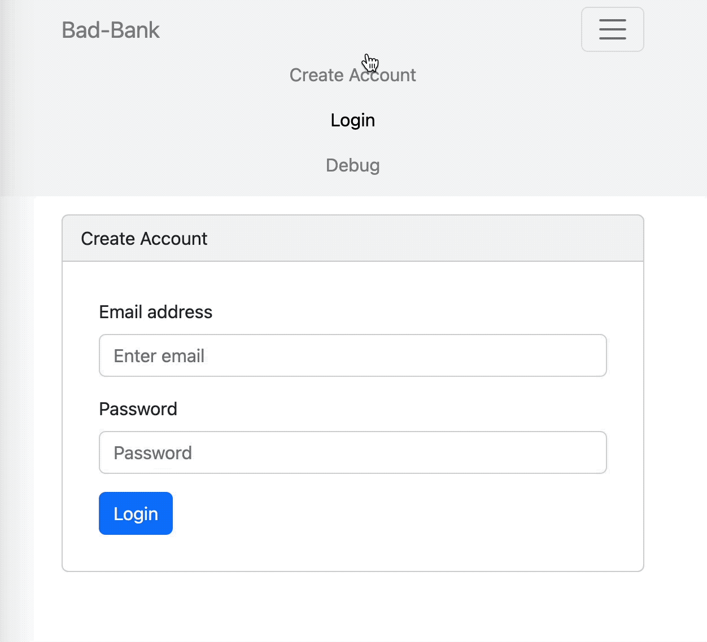

# Bad-Bank
MIT Assignment

### Setup:

Open 2 terminal tabs & run:

```
// terminal 1
cd server
npm start

// terminal 2
cd client
npm start
```
Open: [http://localhost:3000/](http://localhost:3000/)

### Technology used:
**Backend:**
nodejs · express · mongodb/mongoose, cors · dotenv
**Frontend:**
reactjs

### Features:
- Login, Signup, Logout
- View Account Balance / Withdraw / Deposit
- View all accounts - for debug purposes

### License:
MIT

### Demo:
